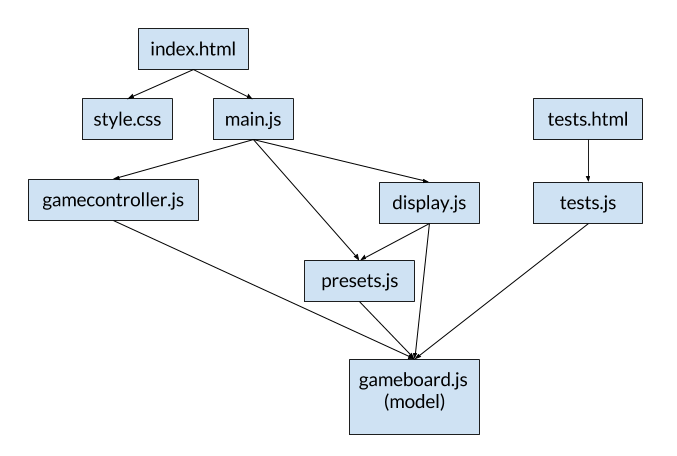

6.170 Project 2: Game of Life
=====

## Separation of concerns
For this app, we need to cover a set of basic functionalities:
* Model the game board and track cell states
* Display the game board on the page
* Advance the state of the game
* Set the board to preset patterns
* Test the gameboard behavior

I added a module for each of these behaviors, and also added a `main.js` module to link them all together and load them on the page.

## Module dependencies
The JavaScript modules are: 
* `main.js` - calls the functions to set up the gameboard and attach click handlers
* `gameboard.js` - the gameboard structure and cell states (model)
* `gamecontroller.js` - advances the state of the gameboard; also resets and randomizes it
* `display.js` - sets up the HTML elements of the gameboard and the subscriber pattern
* `presets.js` - defines and generates preset boards
* `tests.js` - tests model behavior

There were also views and styling for the views:
* `index.html` - the main page
* `tests.html` - the QUnit test page
* `style.css` - styling for the main page

The dependencies of the modules can be visualized as follows (arrows mean "depends on"): 

I don't really see huge issues with the dependency graph. The subscriber pattern made updating the view really easy so that the model (`gameboard.js`) didn't have to depend on `display.js`. 

## Functionals
I used functionals to generate the board, iterate through cells, and display the board. One fun use of functionals I incorporated was in the `repeatPattern` function in `presets.js`--I used `map` to assign cells values based on their position in the pattern. 

## Fun stuff
I'm proud of the way I implemented the preset board generation! Board presets are generated independently of the board size and simply repeat the defined preset horizontally and vertically. One tradeoff I made with the subscriber pattern was that when I updated a single cell manually (i.e. the user clicks on the cell), the view updating function iterated through the entire board and checked every cell for changes. I also had fun with the visual design of the page :)